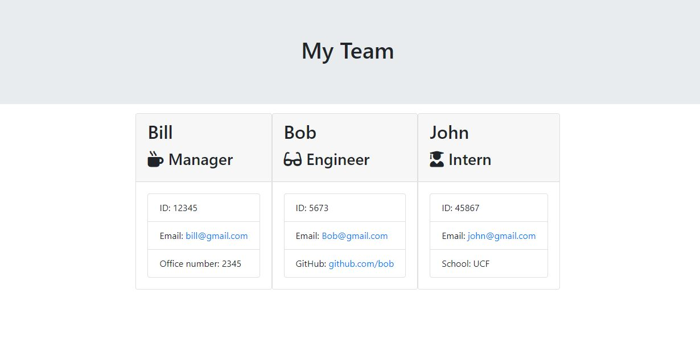

# Employee Summary Generator

This project uses the command line application to create a generator that uses the user's input to display an employee summary. Having a large team of people can be hard to manages especially when it comes to documenting their information. With this application, a series of prompts will appear in the command line based on the employee information. Once all the prompts are answered, that information will appear in an html file, in which it can be ran through a web browser.

## How it Works
- Install npm inquire
- Move into the 'team.html' file
- Type in 'node team.html' in the command line
- Answer the given prompts
- Open the 'team.html' file into a web browser and see the results

